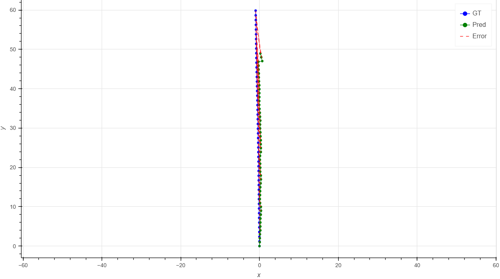

# 🚗 Visual Odometry

This repository summarizes my work on implementing Visual Odometry (VO) from scratch, covering **Monocular VO** and **Stereo VO** pipelines. This project was undertaken as part of my learning in the domain of computer vision and state estimation.

<p align="center">
  
</p>

---

## 🎯 Goal

The goal of this project is to implement Visual Odometry to estimate the motion of a camera or stereo rig using sequential images. This repository aims to serve as a learning resource for anyone interested in understanding the principles of VO.

Key features include:
- **Monocular Visual Odometry**: Using single-camera input for trajectory estimation.
- **Stereo Visual Odometry**: Leveraging stereo camera input for depth-aware motion estimation.
- Feature extraction, matching, and pose estimation techniques.
- Evaluation against ground-truth trajectories (KITTI dataset)

---

## 🛠️ Test/Demo

To test or run the implementations (after cloning the repo):

- **Monocular Visual Odometry**:
```
python VO.py
```

- **Stereo Visual Odometry**:
```
python stereo_visual_odometry.py
```

---

## 📊 Results

### 📈 Monocular Visual Odometry
- **Trajectory and Error Plot**:
<p align="center">
  
</p>

<!-- - **Reprojection Error**:
<p align="center">
  
</p> -->

### 📈 Stereo Visual Odometry
- **Trajectory and Error Plot**:
<p align="center">
  
</p>

<!-- - **Depth Map Reconstruction**:
<p align="center">
  
</p> -->

---

